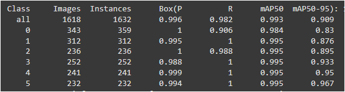
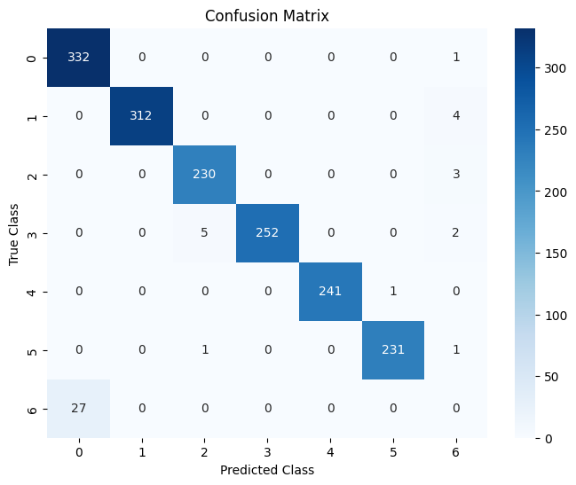

# Finger-Gestures-Detection-using-YOLOv8
This project implements a YOLOv8-based model to detect finger gesture numbers (0-5) using a custom dataset. The goal is to create a lightweight and accurate detector that can recognize hand signs for applications in HCI (Human-Computer Interaction), sign language, and gesture control systems.

## 🚀 Installation

1️⃣ Clone the repository:
```bash
git clone https://github.com/azizkrifa/finger-gestures-detection_using-YOLOv8.git
cd finger-gestures-detection_using-YOLOv8
```

2️⃣ Install dependencies:
```bash
pip install -r requirements.txt
```

## 📂 Dataset

The dataset is a merged collection of finger gesture images (numbers 0 to 5), created by combining samples from multiple Roboflow datasets (versions v1 to v7).  
You can access the datasets used in this project here:  
👉 [all the datasets link](https://universe.roboflow.com/hands-rirpj/fingers-numbers/dataset/7)


    Images + labels are merged and split into train, val, test using split-folders.

    YOLO format labels (.txt files).

### Classes:

    0: Zero

    1: One

    2: Two

    3: Three

    4: Four

    5: Five

### Directory structure:

    Datasets/
    └── fingers_dataset(split)/
        ├── train/
        │    ├── images/
        │    └── labels/
        ├── val/
        │    ├── images/
        │    └── labels/
        ├── test/
        │    ├── images/
        │    └── labels/
        └── data.yaml


## 🏋️‍♂️ Training Details

    -Model: YOLOv8 nano (yolov8n.pt)

    -Input size: 416×416

    -Epochs: 50

    -Batch size: 32

    -Checkpoints: best model + per-epoch models saved

## 📊 Results / Metrics

  The model achieves good mAP and precision on validation and test sets ( >> 90% ) .

  ### Training History : 


  ### Evaluation Metrics (test set) : 

  
  


  ### Confusion Matrix : 

  📝 Note: Our dataset has 6 classes (0 to 5), but the Ultralytics ConfusionMatrix object includes an extra row and column, making it a 7×7 matrix. This extra class corresponds to the background/no-detection category, which accounts for:
    
-False positives (detections with no matching ground truth)

-False negatives (ground truth objects missed by the model)

   


   ### Predictions : 
 


  


  

